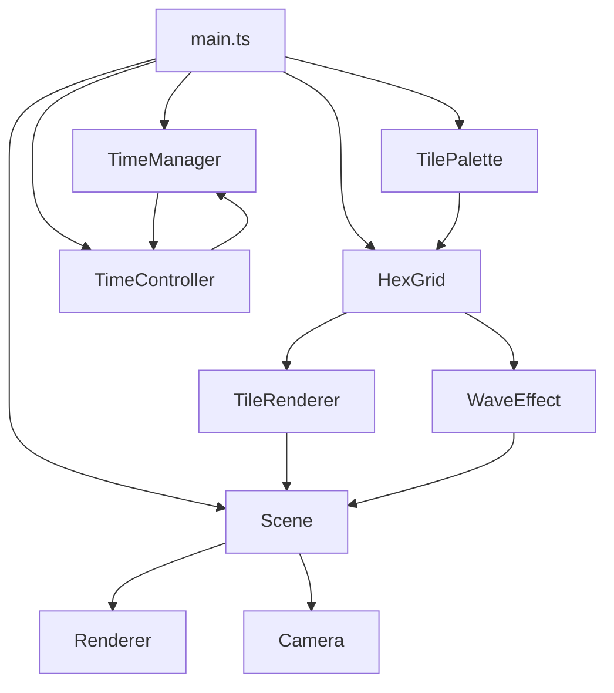

# VibeCity Architecture

## System Overview

VibeCity is a 3D visualization application built with a modular architecture. Each module has clearly defined responsibilities and is designed for loose coupling.

## Core Modules

### 1. Scene Management (`core/Scene.ts`)

**Responsibilities**: 
- Initialize and manage Three.js scene
- Set up camera, renderer, and lighting
- Control animation loop

**Key Components**:
- `Scene` - Main scene class
- `Camera` - PerspectiveCamera with orbit controls
- `Renderer` - WebGLRenderer
- `AmbientLight` - Ambient lighting (intensity: 0.8)
- `PointLight` - Sunlight (intensity: 2.0)

### 2. Hexagonal Grid System (`hex/HexGrid.ts`)

**Responsibilities**:
- Generate and manage hexagonal grid
- Implement axial coordinate system
- Manage tile state
- Control ripple effects

**Coordinate System**:
```
Axial Coordinates (q, r)
  q: horizontal direction
  r: diagonal direction
  
World Coordinates (x, z)
  x = q * hexWidth * 3/4
  z = r * hexHeight + q * hexHeight/2
```

**Key Methods**:
- `getHexVertices()` - Calculate hexagon vertices
- `axialToWorld()` - Coordinate transformation
- `worldToAxial()` - Reverse transformation
- `placeTile()` - Place tile

### 3. Tile System (`hex/`)

#### TileTypes.ts
**Responsibility**: Define tiles and settings

```typescript
enum TileType {
  DIRT = 'dirt',
  WATER = 'water',
  GRASS = 'grass',
  STONE = 'stone'
}

interface TileDefinition {
  type: TileType;
  color: THREE.Color;
  height: number;
}
```

#### TileRenderer.ts
**Responsibility**: Generate 3D tile meshes

**Rendering Strategy**:
- Generate 3D hexagons with `ExtrudeGeometry`
- Apply different colors to top and side faces using material arrays
  - Top face: Base color (100%)
  - Side face: Base color at 60% (darker)
- Use `MeshBasicMaterial` for lightweight rendering

**Optimizations**:
- Skip lighting calculations (using BasicMaterial)
- Use color differences for depth perception
- Remove unnecessary normal calculations

### 4. Time System (`time/TimeManager.ts`)

**Responsibilities**:
- Simulate in-game time
- Control time flow
- Emit time change events

**Time Management**:
```typescript
class TimeManager {
  currentTime: number;    // 0.0 - 24.0 (hours)
  timeScale: number;      // Time flow speed
  
  update(deltaTime: number): void
  setTime(time: number): void
}
```

**Events**:
- `time-changed` - Fired when time changes

### 5. UI Components (`ui/`)

#### TilePalette.ts
**Responsibility**: Tile selection interface

**Features**:
- Generate and manage tile buttons
- Visual feedback for selection state
- Emit tile selection events

#### TimeController.ts
**Responsibility**: Time control interface

**Features**:
- Digital clock display
- Play/pause button
- Draggable time slider

### 6. Effects (`effects/WaveEffect.ts`)

**Responsibility**: Ripple effect simulation

**Algorithm**:
```typescript
// Calculate wave intensity with distance attenuation
intensity = baseIntensity * (1 - distance / maxDistance)

// Decay over time
intensity *= (1 - age / maxAge)
```

## Data Flow



## Event System

VibeCity uses an event-driven architecture.

### Key Events

| Event Name | Emitter | Subscribers | Data |
|-----------|---------|-------------|------|
| `time-changed` | TimeManager | Scene, UI | `{ time: number }` |
| `tile-selected` | TilePalette | main.ts | `{ tileType: TileType }` |
| `play-toggled` | TimeController | TimeManager | `{ isPlaying: boolean }` |
| `time-set` | TimeController | TimeManager | `{ time: number }` |

## Performance Optimizations

### Rendering Optimizations
1. **Lightweight Materials**
   - Use `MeshBasicMaterial`
   - Skip PBR calculations
   - Use color differences for depth perception

2. **Geometry Optimizations**
   - Remove unnecessary normal calculations
   - Disable shadow calculations

3. **Memory Management**
   - Implement mesh dispose methods
   - Proper resource cleanup

### Animation Optimizations
```typescript
// Delta time-based updates
animate(time: number) {
  const deltaTime = (time - lastTime) / 1000;
  timeManager.update(deltaTime);
  // ...
}
```

## Extensibility

### Adding New Tile Types

1. Add definition in `TileTypes.ts`:
```typescript
export enum TileType {
  // Existing...
  FOREST = 'forest'
}

export const TILE_DEFINITIONS: Record<TileType, TileDefinition> = {
  // Existing...
  [TileType.FOREST]: {
    type: TileType.FOREST,
    color: new THREE.Color(0x228B22),
    height: 0.3,
  }
};
```

2. Add palette color:
```typescript
export const TILE_PALETTE_COLORS: Record<TileType, string> = {
  // Existing...
  [TileType.FOREST]: '#228B22'
};
```

### Adding New Effects

1. Create new class in `effects/` directory
2. Instantiate in `Scene.ts`
3. Register in animation loop

## Design Patterns

### Observer Pattern
- Event-driven design using `EventEmitter`
- Achieves loose coupling between components

### Factory Pattern
- `TileRenderer.createTileMesh()` for mesh generation
- Ensures consistent object creation

### Singleton Pattern
- Global state management in `TimeManager`, `AudioManager`, etc.

## Future Extensibility

### Planned Features
- [ ] Tile deletion functionality
- [ ] Save/load functionality
- [ ] Tile connection logic (visual road connections, etc.)
- [ ] More diverse tile types
- [ ] Camera presets (aerial view, ground view, etc.)
- [ ] Particle effects
- [ ] Multiplayer support

### Technical Improvements
- [ ] Offload physics calculations to Web Workers
- [ ] Implement LOD (Level of Detail) system
- [ ] Optimize rendering with instancing
- [ ] Use texture atlases

---

Last Updated: 2026-01-17
